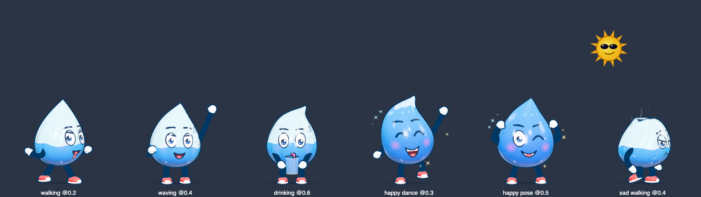

# 💧 Water Buddy

A macOS menu-bar app that reminds you to drink water. At the interval you pick, **Droppy**, a squishy water drop on
rubber-hose legs, walks onto your screen and asks if you've had a glass.

- **🥤 Taking water now**: Droppy sips through a straw and fills up, does a splash dance, flexes and skips off the other
  side. The glass is added to today's count.
- **⏰ Remind me later**: a smug sun shows up and Droppy dries out (pale, wrinkly, steaming, crying), then trudges off.
  It comes back after the snooze time.
- If you don't answer within 2 minutes, it counts as "Remind me later".



## Install

### Download (easiest)

1. Download **Water-Buddy-x.y.z.dmg** from the [latest release](https://github.com/Sravankumartangudu/water-buddy/releases/latest).
   It works on Apple silicon and Intel Macs.
2. Open the DMG and drag **Water Buddy** into **Applications**.
3. Open **Water Buddy** from Applications, Launchpad or Spotlight (**⌘ Space**, type *Water Buddy*).

The app isn't notarized by Apple, so the first launch is blocked with a warning. To allow it once:

- **macOS 15 Sequoia or later:** click **Done** on the warning, open **System Settings → Privacy & Security**, scroll
  down and click **Open Anyway** next to Water Buddy, then confirm.
- **macOS 14 or earlier:** right-click Water Buddy in Applications, choose **Open**, then click **Open** again.

Or run this once in Terminal:

```bash
xattr -dr com.apple.quarantine "/Applications/Water Buddy.app"
```

### Build from source

You need [Node.js](https://nodejs.org) (any current LTS).

```bash
git clone https://github.com/Sravankumartangudu/water-buddy.git
cd water-buddy
npm install     # first time only
npm run dist    # builds Water Buddy.app and copies it to /Applications (Apple silicon)
```

To build the downloadable DMG yourself, run `npm run package`. It writes `dist/Water-Buddy-x.y.z.dmg`, a universal build
for Apple silicon and Intel.

### Update

Quit Water Buddy first (menu-bar drop → **Quit Water Buddy**). Then either download the new DMG and drag it into
Applications again (choose **Replace**), or, if you built from source, run this in the `water-buddy` folder:

```bash
git pull
npm install
npm run dist
```

Your settings and glass count are kept.

### Uninstall

Quit Water Buddy, then delete `/Applications/Water Buddy.app`. To also remove your settings and glass count, delete
`~/Library/Application Support/water-buddy`.

## Use

### First launch

The **Settings** window opens. Pick how often you want reminders, then close it. Water Buddy keeps running in the
background.

### Menu bar

Water Buddy lives in the menu bar as a **drop icon followed by today's count** (for example `3/8`). If your menu bar is
crowded, it may be hidden behind the notch or a menu-bar manager's `«` arrow.

Click the drop for:

| Item | What it does |
| --- | --- |
| *Next reminder at …* | Status line (or *Reminders paused* / *Buddy is on screen now*) |
| *Today: 3 of 8 glasses* | Today's progress |
| **Remind me now** | Bring Droppy out right away |
| **Pause reminders** / **Resume reminders** | Stop or restart the timer |
| **Settings…** | Open the Settings window |
| **Quit Water Buddy** | Quit the app |

While Settings is open, Droppy also appears in the **Dock**, and it leaves when you close the window. Opening the app
again from Spotlight or Finder while it's running brings Settings back.

### When Droppy shows up

Droppy walks in from the left and a speech bubble asks if you've had water, with a short "why drink water" fact and
today's count. Click **Taking water now** or **Remind me later**. The rest of the screen stays clickable while Droppy
is out.

### Settings

| Setting | Notes |
| --- | --- |
| **Today** | Glasses so far, with **−** / **+** to correct the count, plus **Pause** and **Remind me now** |
| **Remind me every** | 15 / 30 / 45 min, 1 h or 1.5 h, or any custom number of minutes |
| **"Remind me later" comes back in** | 5, 10, 15, 20 or 30 min |
| **Active hours** | Only remind between two times (overnight ranges such as 22:00–06:00 work) |
| **Daily goal** | Glasses per day; the count resets every midnight |
| **Sound effects** | Gulps, sniffles and the splash-dance tune |
| **Open at login** | Starts Water Buddy when you log in |
| **Your buddy** | Droppy, or **My photo**: upload a photo, drag and resize the circle over your face and click **Use this face** to put it on Droppy's front. The buttons under the preview play each animation. |

Settings are saved to `~/Library/Application Support/water-buddy/settings.json`.

> If you used Water Buddy from the terminal before installing the app, untick and re-tick **Open at login** so it
> launches the installed app.

## The buddy

Droppy is an original mascot drawn in real time with Three.js (`renderer/character.js`), with no model files. Its body
works as a **hydration gauge**, so the animation shows why water matters:

- **Thirsty (arriving):** the body is only about a third full, pale and wrinkled. Droppy pants with its tongue out,
  sweats, fans itself and points at its low water level.
- **Drinking:** as the glass empties through the straw, the water inside Droppy rises. Gulps ripple the body, wrinkles
  smooth out, and it plumps up, turns bright blue and sparkles.
- **Hydrated:** a jelly "splash dance", then four hops (star jump, spin, star jump, cartwheel), each with a benefit tag
  (🧠 focus, ⚡ energy, ✨ skin, 💪 muscles). Then a double-bicep flex with a wink.
- **Skipped:** a sun in sunglasses appears. Droppy steams, shrivels, goes pale and its tip wilts. It cries (losing even
  more water), trudges off and gives you puppy eyes on the way out.

All sounds, including the marimba splash-dance tune, are synthesized with the Web Audio API (`renderer/sounds.js`), so
there are no audio files.

## Development

```bash
npm start                             # run from source (no install needed)
npm run demo                          # same, but Droppy appears 1.5 s after launch
npm run demo -- --demo=drink          # ...and answers "Taking water now" by itself (or --demo=later)
npm run shot -- out.png "walking@0.1|happy dance@0.3" 2   # contact sheet of buddy states
npm run icons                         # regenerate the app and menu-bar icons from Droppy
npm run icons -- "happy waving" 0.5   # ...using another pose and time
npm run dist                          # build and install Water Buddy.app
npm run package                       # build the universal DMG in dist/
```

> Run these from a normal terminal. If `ELECTRON_RUN_AS_NODE` is set in your shell (VS Code's integrated terminal can
> set it), Electron starts as plain Node and exits. The npm scripts unset it for you.

### Project layout

| Path | What it is |
| --- | --- |
| `main.js` | Main process: timer, active hours, tray menu, Dock icon, settings storage, reminder window |
| `preload.js` | Bridge between the windows and the main process |
| `renderer/overlay.*` | The full-screen, click-through reminder scene (walk-in, bubble, drink and later sequences) |
| `renderer/settings.*` | Settings window, including the photo cropper |
| `renderer/character.js` | Droppy: geometry, shaders, face canvas, limbs, props and all animation states |
| `renderer/sounds.js` | Synthesized sound effects and music |
| `renderer/icon.*`, `tools/icon.js` | Renders the app icon (`assets/icon.png`, `icon.icns`) and menu-bar icon (`assets/trayTemplate*.png`) |
| `renderer/shot.*`, `tools/shot.js` | Screenshot / contact-sheet tool |
| `docs/` | Images used in this README |
| `dist/` | Build output from `npm run dist` (not committed) |

### How Droppy is built

- The body is a lathe drop that is deformed every frame for squash and stretch, jelly ripples, gulp bulges, dryness
  creases and a spring-driven tip.
- A shader paints the water level, rising bubbles and the face.
- The face is a 2D canvas redrawn every frame (eyes, lids, brows, mouth shapes, tongue, tears, sweat), so the
  expressions stretch with the body.
- Arms and legs are bezier "rubber hose" tubes with white gloves and red sneakers. Everything has cartoon outlines.

## License

[MIT](LICENSE). See [CHANGELOG.md](CHANGELOG.md) for what's new.
